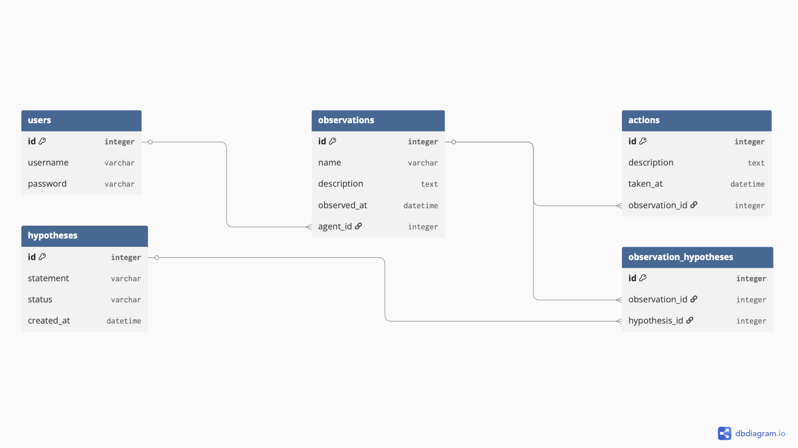

# My World Model

Django CRUD app. An agent logs observations about a monitored environment, records the actions taken on each, and links hypotheses that could explain them. Reads are global across all agents. Writes are owner only.

## Models

- Observation: primary model, full CRUD.
- Action: one-to-many child of Observation, full CRUD.
- Hypothesis: many-to-many with Observation.

## Features

- Django built-in auth: signup, login, logout.
- Admin dashboard registers all three models.
- Authorization: every logged-in agent reads all observations, but edits and deletes only their own.
- Overview table joining observations, agents, actions, and hypotheses.

## Stack

- Django 6
- PostgreSQL
- psycopg2

## Run it

1. createdb worldmodeldb
2. pipenv install
3. pipenv shell
4. python3 manage.py migrate
5. python3 manage.py createsuperuser
6. python3 manage.py runserver

App runs at http://127.0.0.1:8000/

Seed data: python3 manage.py loaddata seed (expects users agent0 through agent4 to exist first).

## ERD

## Screenshots

Walkthrough of full CRUD, auth, and the overview table in [screenshots/](screenshots/).

## Sources

- Fixtures: https://docs.djangoproject.com/en/6.0/howto/initial-data/